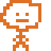
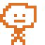
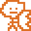

GAME ENGINE FEATURE
=========================

We decided to create a game engine that was really just a glorified sprite handler--we didn't have to do anything to the sprites other than create them, load in their frames, and let them loose. Our engine also handled collision, basic object creation, sounds/music, and physics all on its own. 

HOW I USED THE GAME ENGINE
===============================

I personally made decent use of most of the engine's features, but due to how heavy my workload has been this week I wasn't able to put in any sounds or music like I'd planned. I made decently heavy use of the auto frame tick feature, which allowed me to create and use an idle animation. 

I also was able to implement a punch animation (with included delay!) and others with only a small amount of code. 

The black platforms in my game were made using KinematicBody2D objects, and are entirely handled via the game engine.

The gravity in my game was completely done via the use of the tick() function which is, if you hadn't guessed, inside of the game engine.