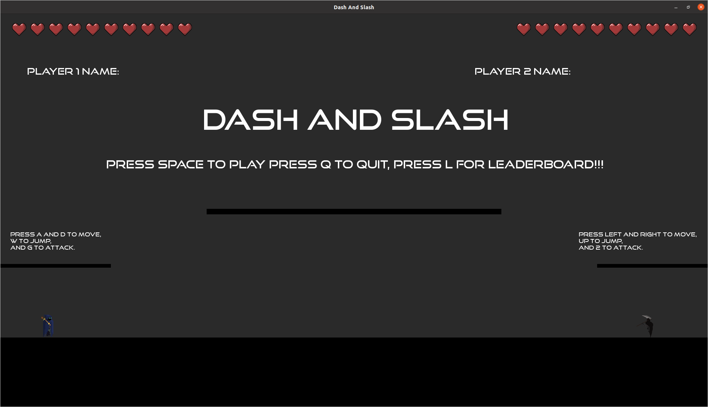
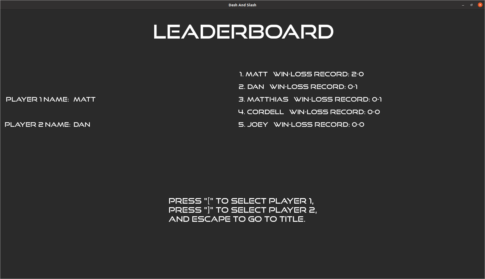
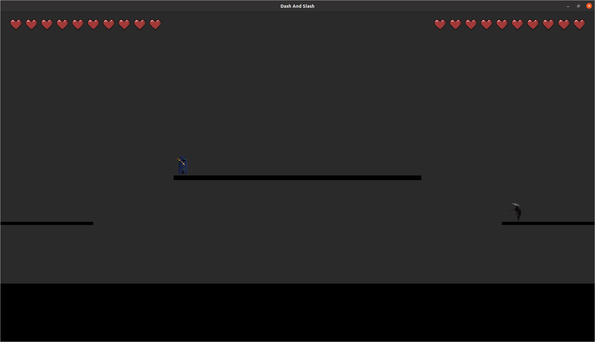

# "Dash and Slash" By: Matthew Bouch

## The Engine
Our game engine called fight_engine is fairly robust and helps to handle physics, sprite loading and animation, sound, and music the last two had a big boost from SFML but we made some classes for convenience. Animation was the big thing for our game engine and that is handled very well by our system we use structs that hold all the animation data for say an Idle animation and we load all the nessecary images for that and then we tell the sprite to play and it does. 

## How Did I Use The Engine?
I used the engine for 2 main functions as far as animation goes. Function 1 was the use of sprites for characters and that works by me loading in all the sprites for things like Idle frames Attacks Jumps etc. Then to get the sprites to play I switch which one is the current animation depending on the current character action and then start the animation loop. The second way I used the animation system was for health and I made the hearts an animation and everytime you get hit the animation ticks to the next heart down. For the other parts of the engine the physics and the Sound and Music I used the KinematicBody2D classes and the SFX and Song classes to implement my other features fairly easily.

## Screenshots

