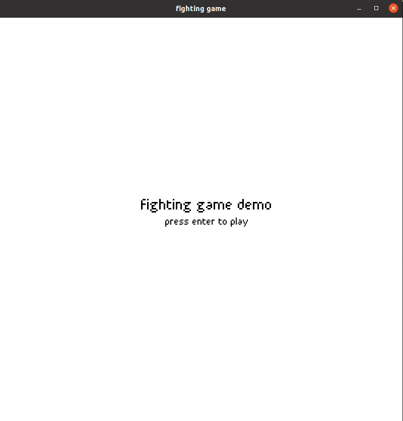
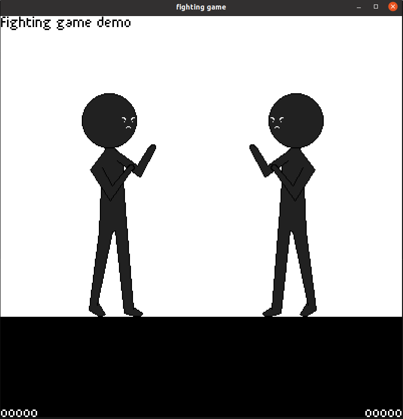
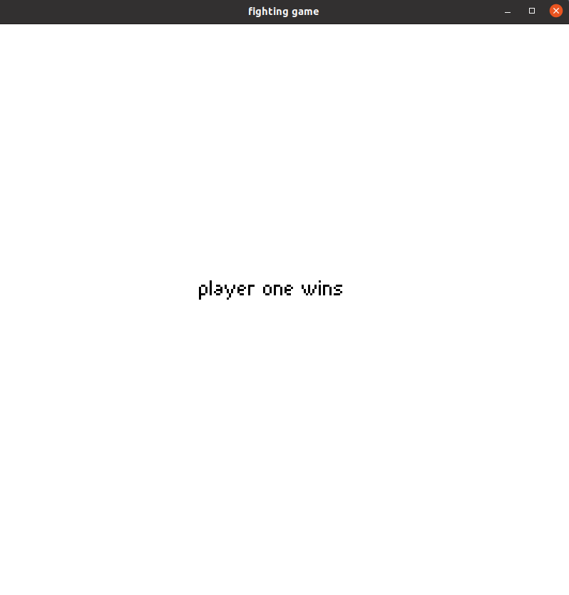

# Fighting Game" By: Owen Elliott

## The Engine
Our game engine called fight_engine is fairly robust and helps to handle physics, sprite loading and animation, sound, and music the last two had a big boost from SFML but we made some classes for convenience. Animation was the big thing for our game engine and that is handled very well by our system we use structs that hold all the animation data for say an Idle animation and we load all the nessecary images for that and then we tell the sprite to play and it does. 

## How Did I Use The Engine?
I used the KinematicBody2D classes from our engine to create easy to manage player models, which allowed me to easily implement collisions and attacks. The animation system came in handy for playing the attack animation automatically. Coming from PICO-8, this system is far superior, but compared to godot it is a bit bare bones, which I think is fine considering the scope of our project. One thing I didn't have time for was the use of sound effects and music, but since I am the one who wrote those classes its safe to say I at least know how they work.

## Screenshots

